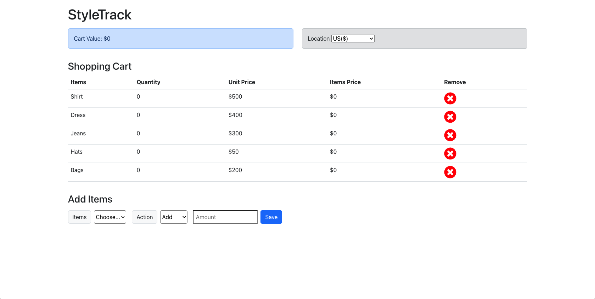

# StyleTrack

## Deployed Application
https://timdolan14.github.io/StyleTrack/

## Github Repo
https://github.com/timdolan14/StyleTrack

## Description

Introducing "StyleTrack," the ultimate fashion companion app designed to effortlessly keep tabs on your clothing and accessory purchases. With its sleek and user-friendly interface, StyleTrack empowers you to meticulously monitor and manage your wardrobe additions. The available items include shirts, jeans, dresses, hats, and bags. 

Whether you're a fashion enthusiast, a minimalist curator, or just someone who values organization, StyleTrack ensures you're always in control of your fashion choices and investments.

## Usage
To review this Site Creation, you can review the notes in each section. Open the Chrome DevTools by pressing Command+Option+I (macOS) or Control+Shift+I (Windows). A console panel should open either below or to the side of the webpage in the browser.

## Credits
N/A

## License
Apache-2.0 license
